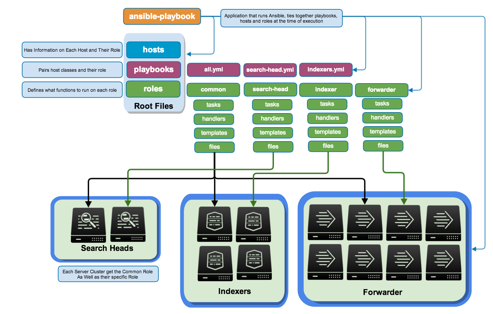

ansible-splunk-simple
==============

Simple Splunk deployment using Ansible, see [Splunk Blog Post](http://blogs.splunk.com/2014/07/12/deploying-splunk-securely-with-ansible-config-management-part-1/) for more information. 

## Features
* built and maintain a complete splunk enviroment in minutes
* adhere by all splunk best practices and OS hardening procedures
* distro agnostic
* runs splunk as splunk user
* can manage your entire splunk installation from one place

## TODOs

* read me for each role
* add roles to ansible galaxy
* Finish license\_master, cluster\_master

## Expectations

This ansible package expectes your servers to be ubuntu base OS. The splunk binaries currently set are *Splunk 6.2* located under
`playbooks/splunk_binaries`

## Installing Ansible

1. `cd /opt`
2. `git clone https://github.com/ansible/ansible`
3. `cd ansible`
4. `git submodule update --init lib/ansible/modules/extras`
5. `git submodule update --init lib/ansible/modules/core`
6. `mkdir /etc/ansible`
7. `cd /etc/ansible`
8. `vim hosts #add your hosts`
9. `source /opt/ansible/hacking/env-setup`
10. `ansible-playbook playbooks/common.yml --list-tasks`

## Ansible Structure

## Running for the First Time

* Ansible is installed, see above
* Make sure you generate your own set of splunk-admin keys for the splunk-admin user. I have included some as an example but **I recommend you to generate your own using:** `ssh-keygen`
* You have root keys copied over to the server you can use `# ssh-copy-id -i ~/.ssh/id_rsa.pub remote-host` or run ansible for the first time with `-k` and it will prompt for the root password and copy the root key over. 
* Inventory is configured under `hosts` file

## Splunk Account Information
**username:** admin 

**password:** buttercup

**user:** https://...

credentials are stored under `playbooks/splunk\_creds` 
The cert/key pair deployed are in the same folder. Although I highly recommend you generate your on keypairs
